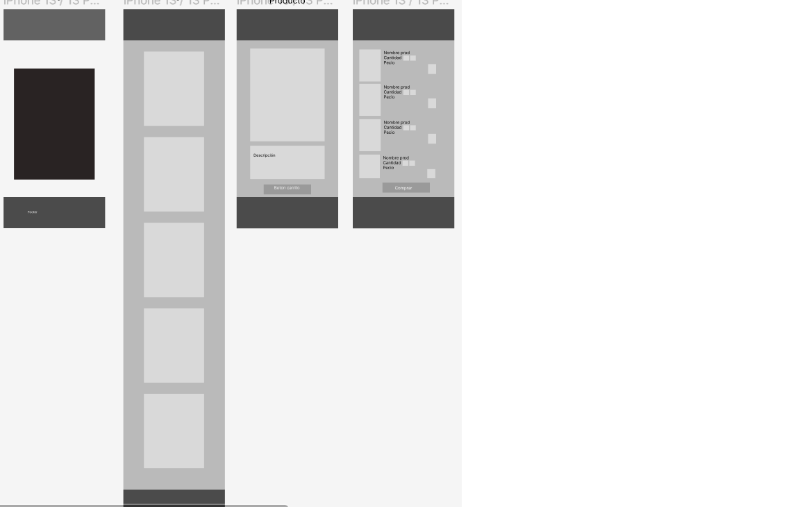
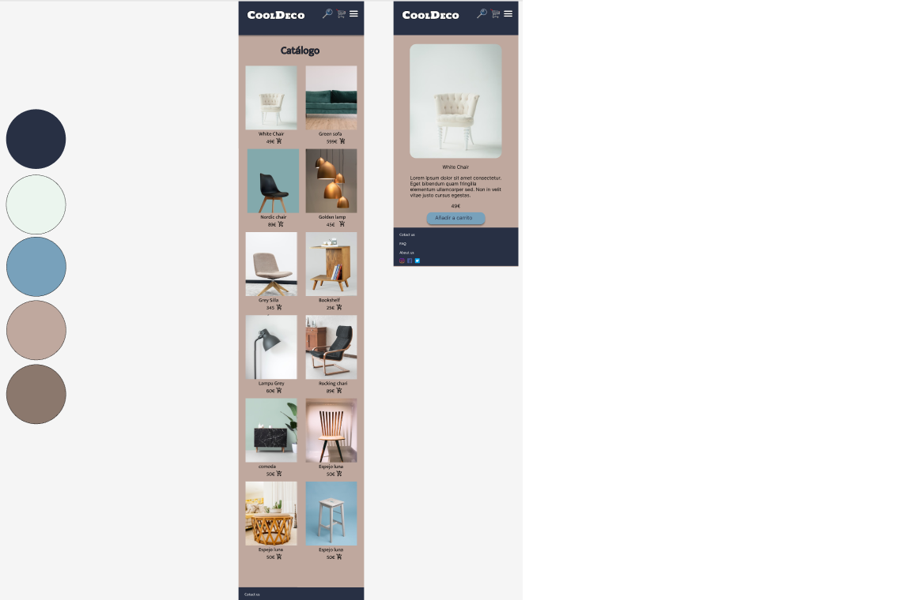
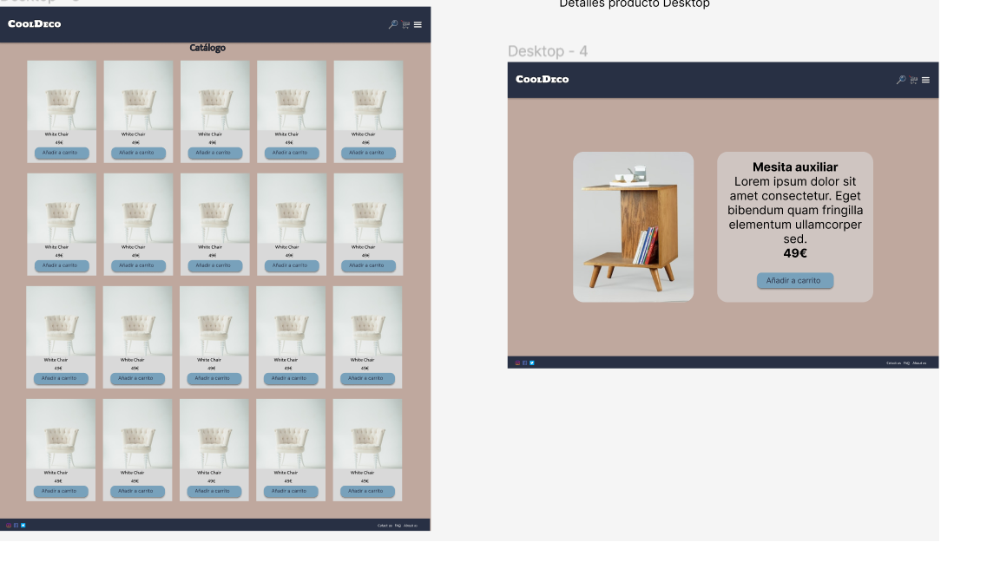

<h1>CoolDeco</h1>

<h2>OBJETIVOS</h2>
<ul>
<li>
Adentrarnos un poco más en la gestión de Proyectos Ágiles (SCRUM y KANBAN)
</li>
<li>
Empezar a escribir, priorizar y dividir en tareas (refinar) las user stories.
</li>
<li>
Realizar Sketches y Mockups en Figma
</li>
<li>
Un poco más de soltura en Git y su flujo de trabajo en equipo.
</li>
<li>
Mejorar la semántica en el código HTML.
</li>
<li>
Dividir CSS en componentes atómicos.
</li>
<li>
Usar CSS Flex y/o CSS Grid.
</li>
<li>
Utilizar MediaQueries para la Responsive Web.
</li>
<li>
Entender un poco más los componentes de una página.
</li>
<li>
Introducir los conceptos básicos de la programación en el navegador. (Javascript)
</li>
</ul>

<h2>Requisitos</h2>
<ul>
<li>
 Mockups (baja fidelidad y alta) en Figma.
</li>
<li>
 Página o sección de inicio (Hero)
</li>
<li>
 Un catálogo de productos
</li>
<li>
 Una ficha de un producto
</li>
<li>
 Una página de carrito de la compra
</li>
<li>
 Podéis añadir secciones, cómo productos destacados…
</li>
<li>
 Debe ser *responsive (mobile first)*
</li>
<li>
 Usar al menos una función en javascript
</li>
</ul>

Ejemplo catálogo:

Ejemplo detalle producto:

<h2>Metodología de trabajo</h2>

Pair programing:
Subdividir el equipo en dos grupos, para trabajar por separado en diferentes ramas, y luego subirlas a la rama principal.

Trello:
https://trello.com/b/XD9o6ceD/buyit-ecommerce-cool-deco

Sketch y mockup usando Figma:

GitHub pages:
https://menchu02.github.io/Buy_it/
